# Data durability and recovery in AWS

This project is part of the Udacity AWS Cloud Architect Nanodegree.

The goal of this project is to :

a.  Build a Multi-AvailabilityZone, Multi-Region database and show how to use it in multiple geographically separate AWS regions.  
b.  Build a website hosting solution that is versioned so that any data destruction and accidents can be quickly and easily undone.


I have followed the instructions for this project are available in GitHub repo [here](https://github.com/udacity/nd063-c2-design-for-availability-resilience-reliability-replacement-project-starter-template).

## Project Setup
### Cloud formation

As per of this project, I used the AWS CloudFormation to create Virtual Private Clouds in two regions in AWS that allows you to create "infrastructure as code". 

Reference has been provided  as part of project instruction available in : https://github.com/udacity/nd063-c2-design-for-availability-resilience-reliability-replacement-project-starter-template/blob/master/cloudformation/vpc.yaml

### Part 1

### Data durability and recovery
In order to achieve the highest levels of durability and availability in AWS, I have deployed a Cloud Formation in 2 AWS regions: An active region and a standby region with different CIDR address ranges for the VPCs.

**Primary VPC:**
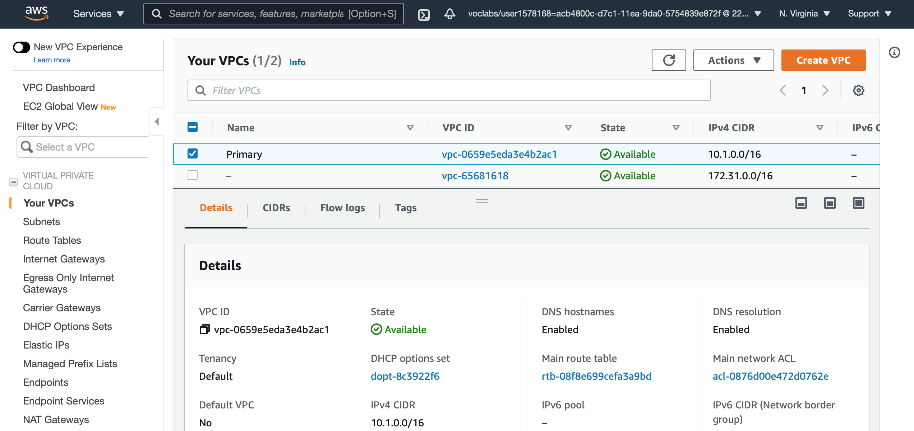

**Secondary VPC:**
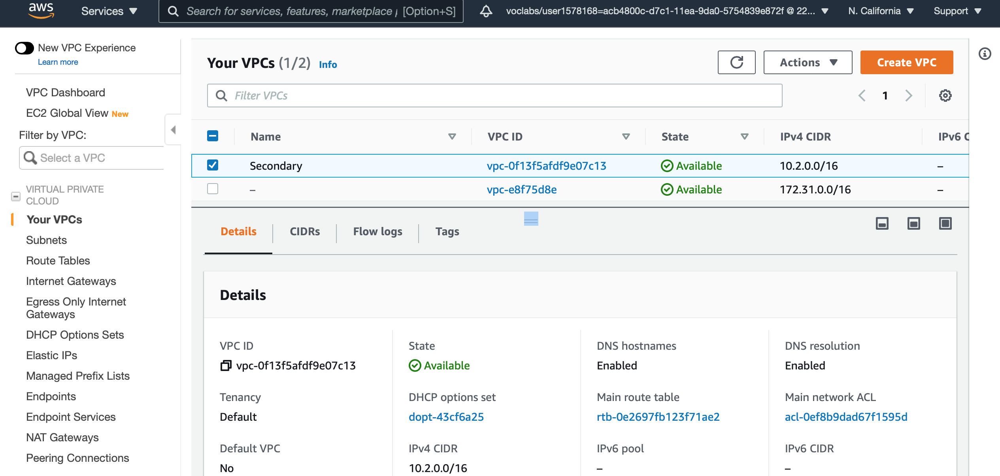

### Highly durable RDS Database

To secure the access of the database, I have created a new RDS **private Subnet group** in the active and standby region. This will ensure that traffic coming directly from the Internet will not be allowed. Only traffic coming from the VPC will be allowed.

**Subnet groups in the active region:**
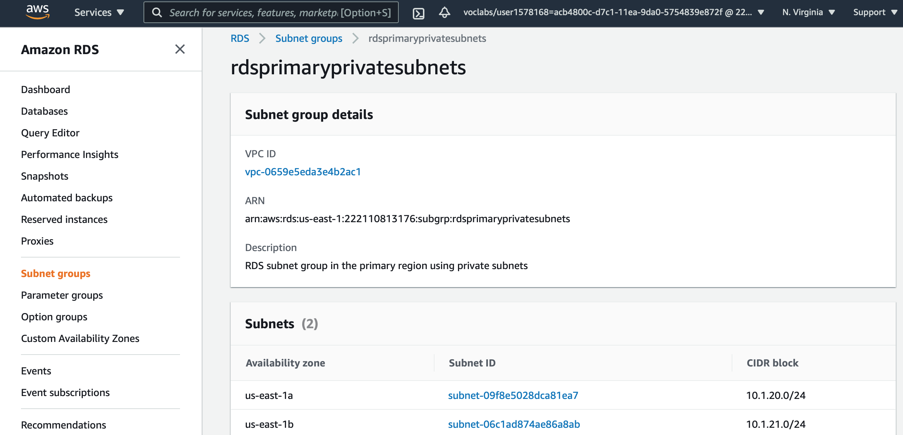

**Subnet groups in the secondary region:**
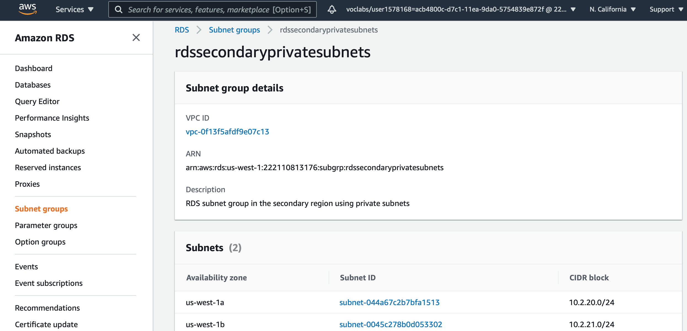


**Subnets of the active region:**
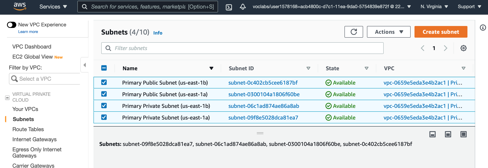

**Subnet of the secondary region:**


**Route tables in subnet of the active region:**
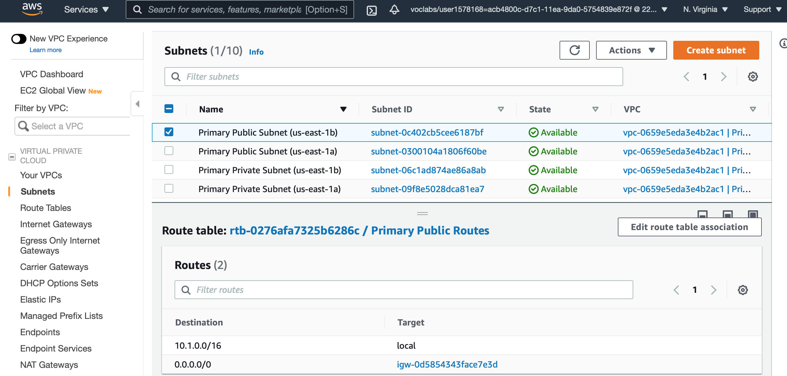

**Route tables in subnet of the secondary region:**
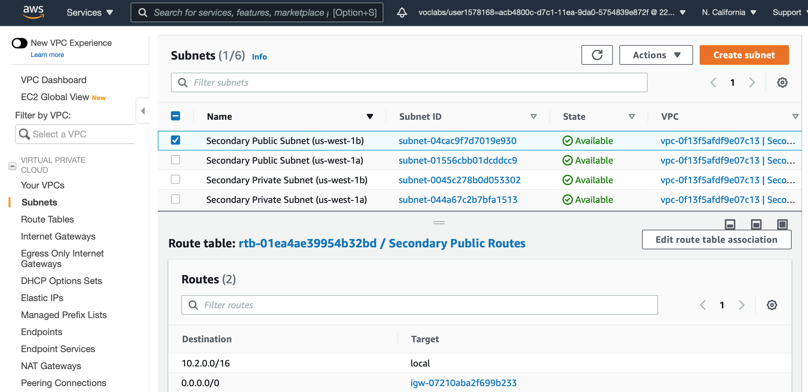

I have then created a new MySQL with the following parameters:
a. Multi-AZ database to ensure a smooth failover in case of a single AZ outage
b. Have only the “UDARR-Database” **security group**. This security group was defined in the Cloud Formation to only allow traffic from the EC2 instance (not yet created). More specifically, this “UDARR-Database” security group allows traffic from "UDARR-Application" security group inside the VPC using this specific port: 3306 (mysql port).
c. Have an initial database called “udacity.” 

**Configuration of the database in the active region:**
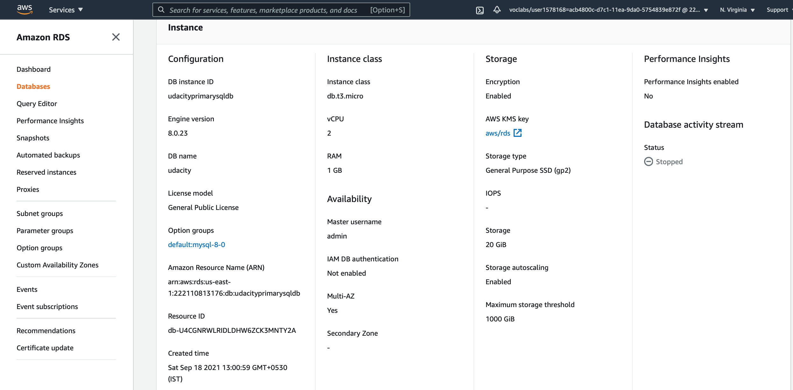

After the primary database has been set up, I have created a read replica database in the standby region. This database has the same requirements as the database in the active region.

**Configuration of the database in the secondary region:**
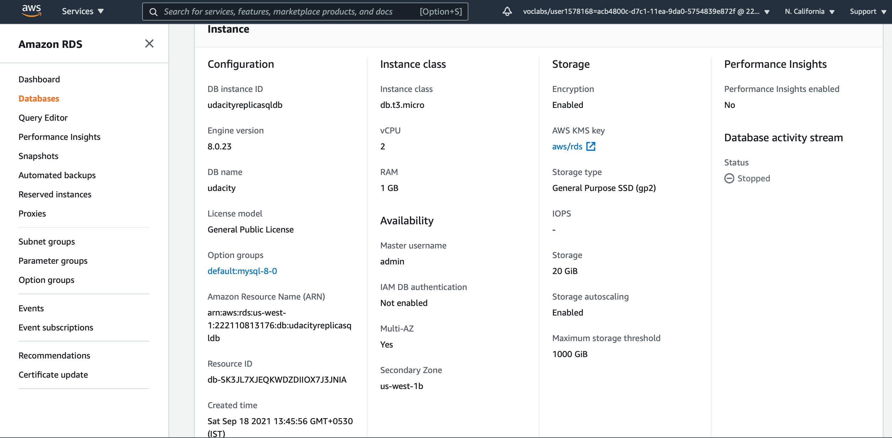

### Estimate availability of this configuration

Description of Achievable Recovery Time Objective (RTO) and Recovery Point Objective (RPO) for this Multi-AZ, multi-region database in terms of:

1. Minimum RTO for a single AZ outage 
If a multi-AZ configuration is set up, the fail over to another AZ will happen automatically which can take a few minutes.
    
2. Minimum RTO for a single region outage
- 06:00 - Problem happens (0 minutes) 
- 06:05 - An amount of time passes before an alert triggers (5 minutes) 
- 06:06 - Alert triggers on-all staff (1 minute) 
- 06:16 - On-call staff may need to get out of bed, get to computer, log in, log onto VPN (10 minutes) 
- 06:26 - On-call staff starts diagnosing issue (10 minutes) 
- 06:41 - Root cause is discovered (15 minutes) 
- 06:46 - Remediation started (5 minutes) :  Promote secondary instance to be the new master and then route the traffic to the new endpoint
- 06:56 - Remediation completed (10 minutes) 

Total time: 56 minutes 

3. Minimum RPO for a single AZ outage
As it only takes a few minutes to fail over to another AZ, a few minutes of data will be lost.   
       
4. Minimum RPO for a single region outage 
If we set up an RDS database with automatic backups enabled, the RPO will be based on how often data is backed up. If we set up a backup every 1 hour, the minimum RPO will be 1 hour.

### Demonstrate normal usage

In the active region:
I created an EC2 keypair and launched an Amazon Linux EC2 instance in the active region with the following configuration:
a. VPC's public subnet
b. Security group ("UDARR-Application") that allows incoming traffic (SSH) from the Internet.

I established a SSH connection to the instance by running this command:
```
ssh -i {absolute/path/to/secureconnet.pem} {EC2 identifiers provided on the EC2 console while clicking on connect}
```
After being connected and having mysql installed, I connected to my database by running this command:
```
mysql -u admin -p -h {PRIMARY_DATABASE_ENDPOINT}
```

Log of connecting to the database, creating the table, writing to and reading from the table:
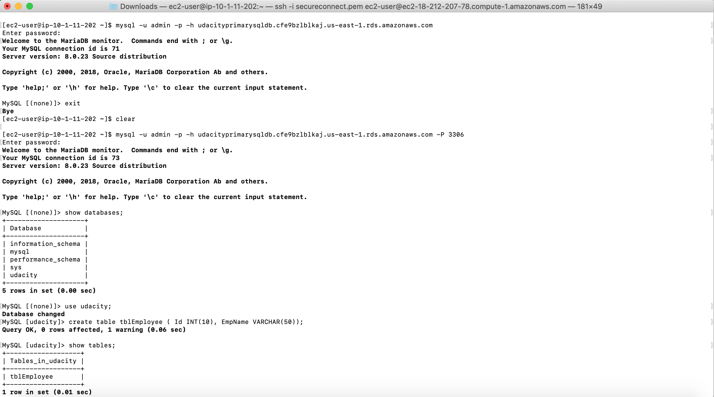
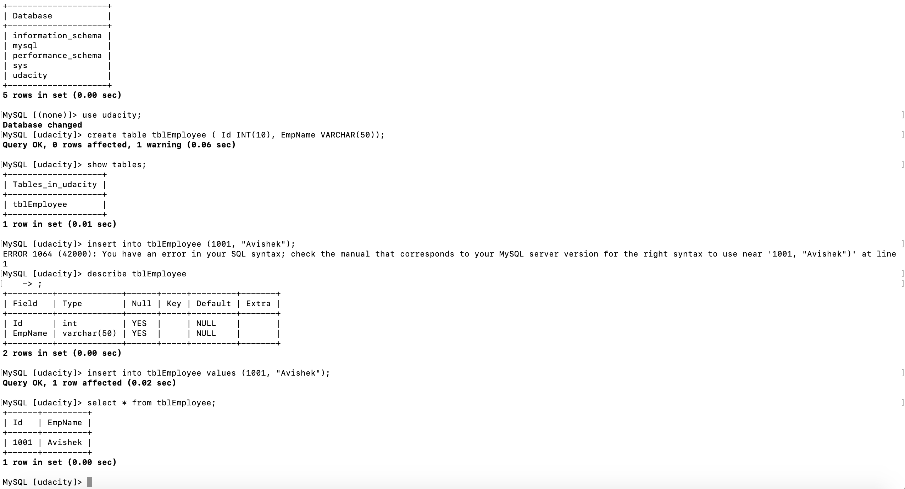

### Monitor database

**DB Connections:**
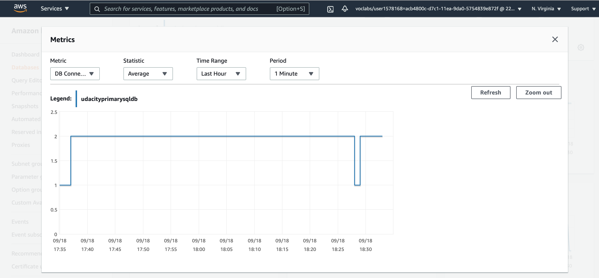

**DB Replication:**
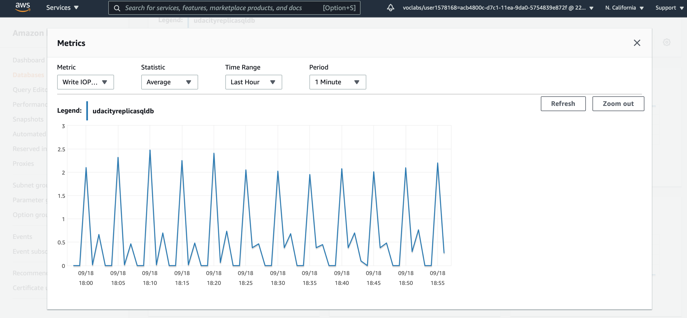

### Part 2
### Failover And Recovery
In the standby region:

I have created an EC2 keypair in the region and launched an Amazon Linux EC2 instance in the standby region with the same configuration as before.
Since the database in the standby region is a read replica, we can only read from the database but we cannot perform any DML operation (insert data).

Database configuration **before the database promotion:**
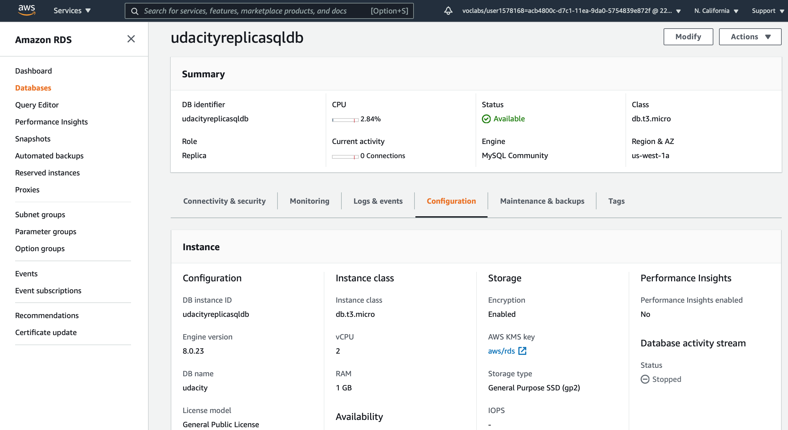

Log of connecting to the database, writing to and reading from the database **before the database promotion:**
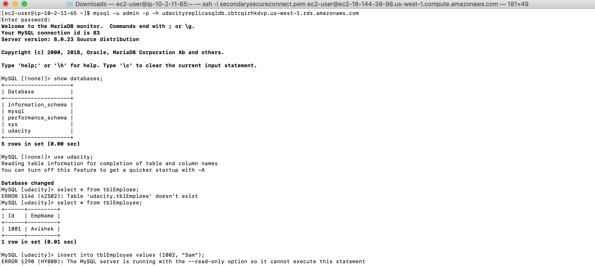

After promoting the read replica, we can now insert data into and read from the read replica database.

Database configuration **after the database promotion:**
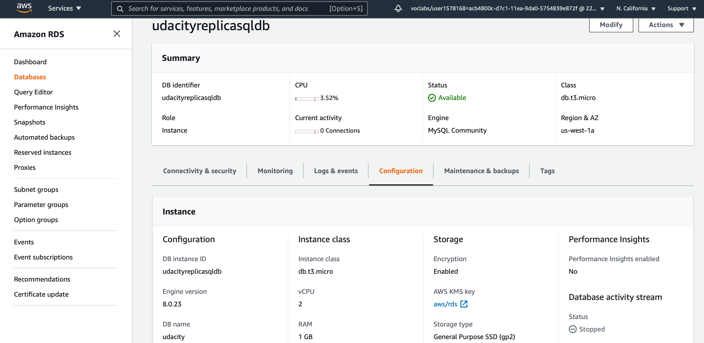

Log of connecting to the database, writing to and reading from the database **after the database promotion:**
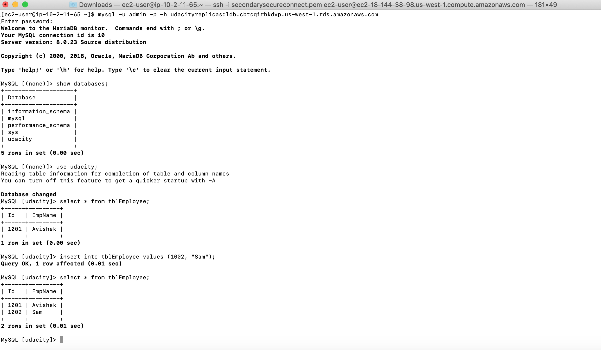


### Part 3
### Website Resiliency

Build a resilient static web hosting solution in AWS. Create a versioned S3 bucket (udacity-primary-s3), configured it as a static website and enabled versioning.

Then,

1. Entered  “index.html” for both Index document and Error document
2. Uploaded the files from the GitHub repo (under `/project/s3/`)
3. Paste URL into a web browser to see the website (http://udacity-primary-s3.s3-website-us-west-1.amazonaws.com). 


**Original webpage:**
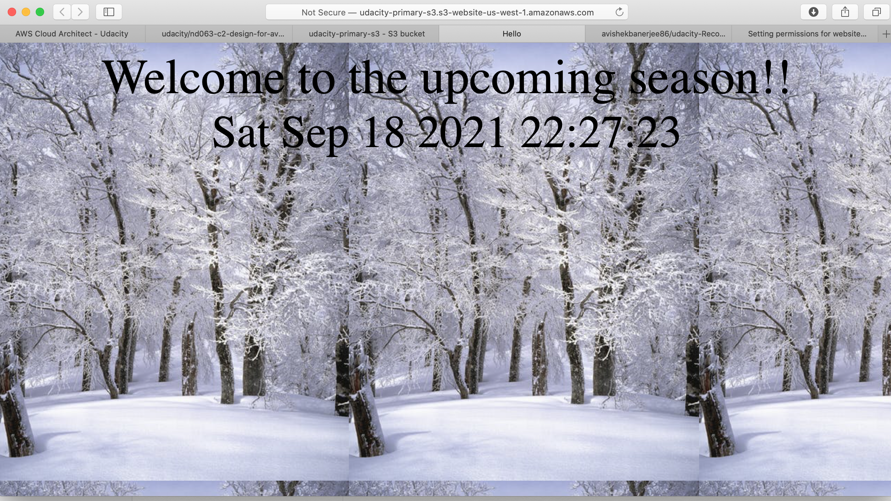

I have now  “accidentally” change the contents of the website such that it is no longer serving the correct content

1. Change `index.html` to refer to a different “season” ("Spring")
2. Re-upload `index.html`
3. Refresh web page

**Modified webpage:**
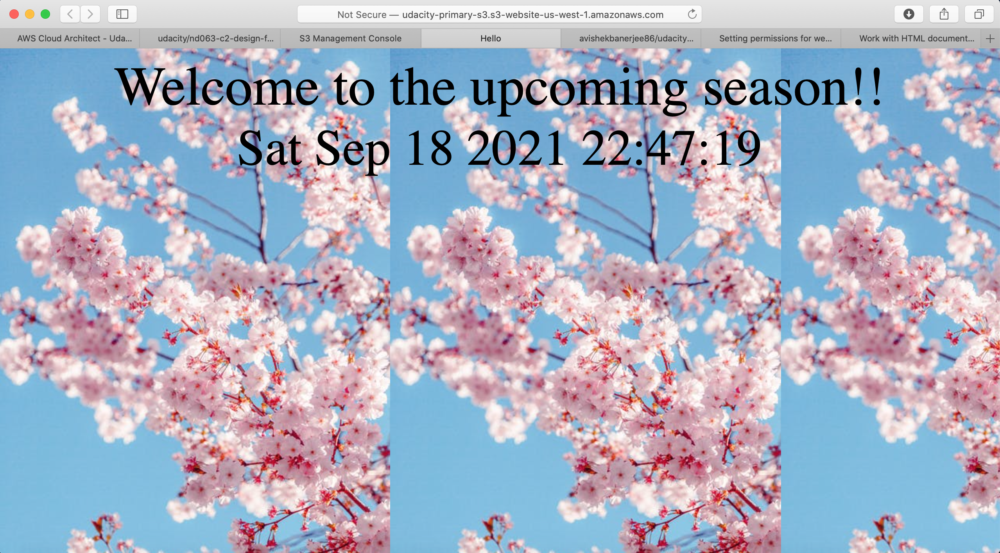

I have now  “recover” the website by rolling the content back to a previous version.

1. Recover the `index.html` object back to the original version
2. Refresh web page

**Modified webpage (reverted):**
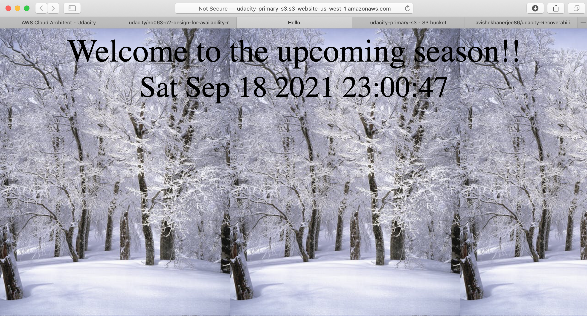

I have now “accidentally” delete contents from the S3 bucket. i.e. Delete “winter.jpg”

**Webpage after content deleted:**
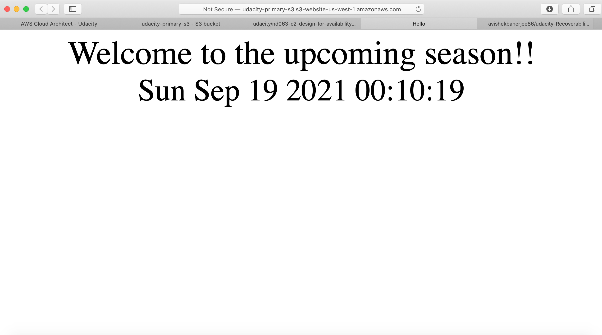

**Existing versions of the file showing the "Deletion marker".**
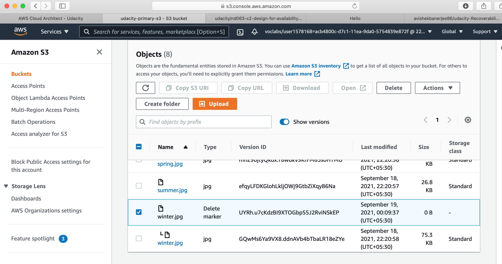

I now need to “recover” the object:

1. Recover the deleted object
2. Refresh web page

**Recovered Website:**
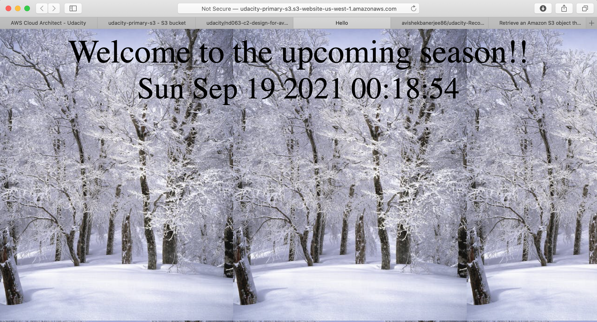


                                               **End of project **

