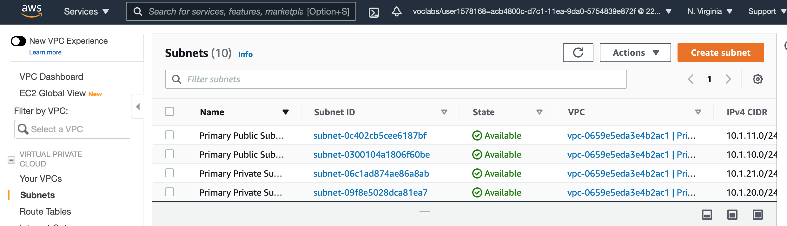
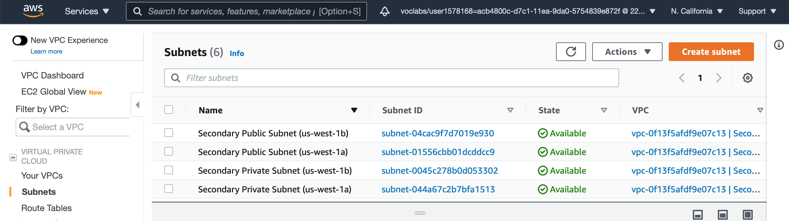

# Data durability and recovery in AWS

This project is part of the Udacity AWS Cloud Architect Nanodegree.

The goal of this project is to :
a.  Build a Multi-AvailabilityZone, Multi-Region database and show how to use it in multiple geographically separate AWS regions.  
b.  Build a website hosting solution that is versioned so that any data destruction and accidents can be quickly and easily undone.

The instructions for this project are available [here](https://github.com/udacity/nd063-c2-design-for-availability-resilience-reliability-replacement-project-starter-template).

## Project Setup
### Cloud formation
In this project, I used the AWS CloudFormation to create Virtual Private Clouds in two regions in AWS. CloudFormation is an AWS service that allows you to create "infrastructure as code". 

A configuration file written in a YAML file was provided as part of the instruction to automate the creation of the VPCs with public and private subnets and Security Groups. Reference : https://github.com/udacity/nd063-c2-design-for-availability-resilience-reliability-replacement-project-starter-template/blob/master/cloudformation/vpc.yaml

### Part 1

### Data durability and recovery
In order to achieve the highest levels of durability and availability in AWS, I deployed a Cloud Formation in 2 AWS regions: An active region and a standby region with different CIDR address ranges for the VPCs.

**Primary VPC:**

**Secondary VPC:**

### Highly durable RDS Database

To secure the access of the database, I created a new RDS **private Subnet group** in the active and standby region. This means that traffic coming directly from the Internet will not be allowed. Only traffic coming from the VPC.

**Subnet groups in the active region:**

**Subnet groups in the secondary region:**

**Subnets of the active region:**

**Subnet of the secondary region:**

**Route tables in subnet of the active region:**

**Route tables in subnet of the secondary region:**

